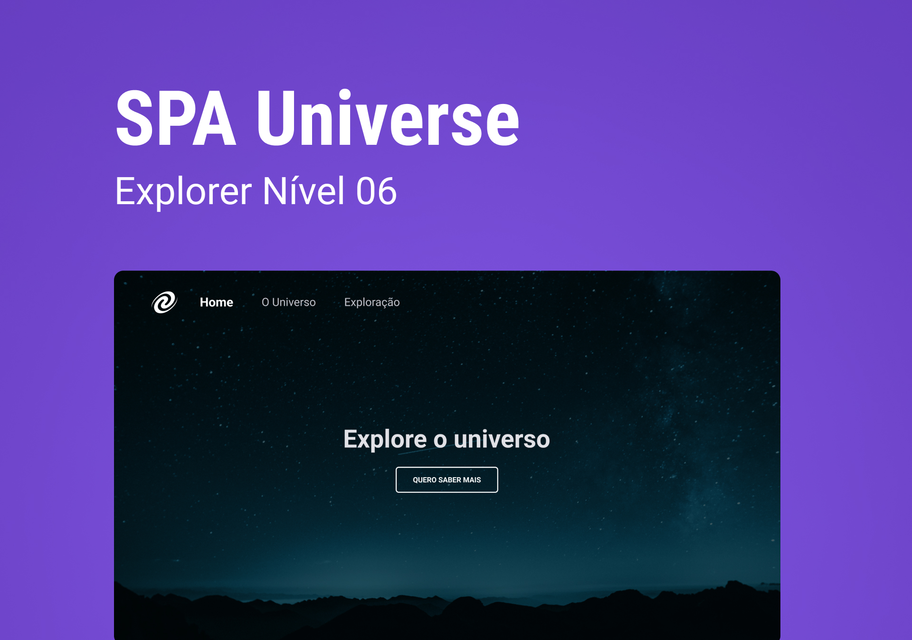

<h1 align="center"> SPA Universe</h1>

<p align="center">
Desafio avançado do explorer 10  <br/>
<a href="https://www.rocketseat.com.br/explorer">Connheça o Explorer.</a>
</p>

<p align="center">
  <a href="#-tecnologias">Tecnologias</a>&nbsp;&nbsp;&nbsp;|&nbsp;&nbsp;&nbsp;
  <a href="#-projeto">Projeto</a>&nbsp;&nbsp;&nbsp;|&nbsp;&nbsp;&nbsp;
  <a href="#-layout">Layout</a>&nbsp;&nbsp;&nbsp;|&nbsp;&nbsp;&nbsp;
  <a href="#memo-licença">Licença</a>
</p>

<p align="center">
  
</p>

<br>

<p align="center">
  
</p>

## 🚀 Tecnologias

Esse projeto foi desenvolvido com as seguintes tecnologias:

- HTML
- CSS
- JavaScript
- Git e Github
- Figma

## 💻 Projeto
Criamos uma SPA ( Single Page Application ),  Aplicação de Página Única, e trata-se de um método - relativamente novo - para o desenvolvimento web baseado em técnicas de front-end, usando sobretudo de JavaScript.

As praticas baseadas em SPA envolvem codificar menos no server-side e mais no client-side, proporcionando ao usuário uma aplicação dinâmica, que carrega recursos conforme necessário. Quando um usuário acessa um site construído dentro do conceito de SPA, a aplicação e seus componentes são armazenados no lado cliente, diferente da forma tradicional, quando o usuário precisa vistar várias páginas diferentes e recarregá-las para visualizar atualizações.

- [Acesse o projeto finalizado, online](https://erlanmarinho.github.io/explorerDesafioForm2/)

## Instalação
Você precisará do [Node.js](https://nodejs.org) instalado no seu computador para criar este aplicativo.

```bash
1º git clone git@github.com:erlanmarinho/explorerSPA-Universe.git

2º npm install

3º npm start
```


##  Licença

Esse projeto está sob a licença MIT.

---

Feito com ♥ by Rocketseat :wave: [Participe da nossa comunidade!](https://discord.gg/rocketseat)
